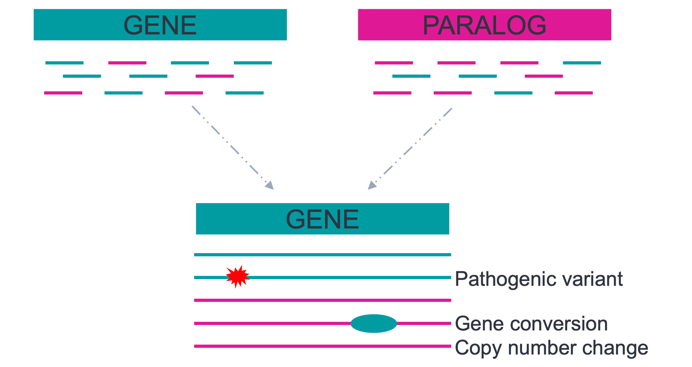

<h1 align="center"></h1>

<h1 align="center">Paraphase</h1>

<h3 align="center">HiFi-based caller for highly similar paralogous genes</h3>

Many medically relevant genes fall into 'dark' regions where variant calling is limited due to high sequence homology with paralogs or pseudogenes. Paraphase is a Python tool that takes HiFi aligned BAMs as input (whole-genome or enrichment), phases haplotypes for genes of the same family, determines copy numbers and makes phased variant calls. 


Paraphase takes all reads from a gene family, realigns to one representative gene of the family and then phases them into haplotypes. This approach bypasses the error-prone process of aligning reads to multiple similar regions and allows us to examine all copies of genes in a gene family. This gene-family-centered approach allows Paraphase to perform well when there is a copy number difference between an individual and the reference, as is often the case in segmental duplications.
Futhermore, this approach also streamlines sequence comparisons between genes within the same family, making it straightforward to conduct analyses such as identifying non-allelic gene conversions.  

Paraphase supports 160 segmental duplication [regions](docs/regions.md) in GRCh38. Among these, there are 11 medically relevant regions that are also supported in GRCh37/hg19:
- SMN1/SMN2 (spinal muscular atrophy)
- RCCX module
  - CYP21A2 (21-Hydroxylase-Deficient Congenital Adrenal Hyperplasia)
  - TNXB (Ehlers-Danlos syndrome)
  - C4A/C4B (relevant in autoimmune diseases)
- PMS2 (Lynch Syndrome)
- STRC (hereditary hearing loss and deafness)
- IKBKG (Incontinentia Pigmenti)
- NCF1 (chronic granulomatous disease; Williams syndrome)
- NEB (Nemaline myopathy)
- F8 (intron 22 inversion, Hemophilia A)
- CFC1 (heterotaxy syndrome)
- OPN1LW/OPN1MW (color vision deficiencies)
- HBA1/HBA2 (Alpha-Thalassemia)
- GBA (Gaucher disease and Parkison's disease)
- CYP11B1/CYP11B2 (Glucocorticoid-remediable aldosteronism)
- CFH/CFHR1/CFHR2/CFHR3/CFHR4 (large deletions/duplications, atypical hemolytic uremic syndrome and age-related macular degeneration)

For more details about Paraphase, please check out our latest [paper](https://www.nature.com/articles/s41467-025-57505-2) and our earlier [paper](https://www.cell.com/ajhg/fulltext/S0002-9297(23)00001-0) on its application to the gene SMN1.

- Chen X, Baker D, Dolzhenko E, et al. Genome-wide profiling of highly similar paralogous genes using HiFi sequencing. Nature Communications. 2025. doi:10.1038/s41467-025-57505-2

- Chen X, Harting J, Farrow E, et al. Comprehensive SMN1 and SMN2 profiling for spinal muscular atrophy analysis using long-read PacBio HiFi sequencing. The American Journal of Human Genetics. 2023. doi:10.1016/j.ajhg.2023.01.001

Paraphase supports both whole-genome sequencing (WGS) data and targeted sequencing data, including data generated from [PureTarget](https://www.pacb.com/technology/puretarget) panels. For whole-genome sequencing (WGS) data, we recommend >20X, ideally 30X, genome coverage. Low coverage or shorter read length could result in less accurate phasing, especially when gene copies are highly similar to each other. See our [tutorial](docs/targeted_data.md) for more details on targeted data.

## Contact

If you have suggestions or need assistance, please don't hesitate to reach out by email or open a GitHub issue.

Xiao Chen: xchen@pacificbiosciences.com

## Dependencies

- [samtools](http://www.htslib.org/)
- [minimap2](https://github.com/lh3/minimap2)

## Installation

Paraphase can be installed through pip or conda:
```bash
pip install paraphase
# or
conda install -c conda-forge -c bioconda paraphase
```

Alternatively, Paraphase can be installed from GitHub.
```bash
git clone https://github.com/PacificBiosciences/paraphase
cd paraphase
python setup.py install
```

## Running the program

```bash
paraphase -b input.bam -o output_directory -r genome_fasta
```

Alternatively when you have a list of bam files
```bash
paraphase -l list.txt -o output_directory -r genome_fasta
```

Required parameters:
- `-b`: Input BAM file or `-l`: text file listing BAM files one per line (a BAI file needs to exist in the same directory)
- `-o`: Output directory
- `-r`: Path to the reference genome fasta file

Please note that the input BAM should be one that's aligned to the ENTIRE reference genome (GRCh38, GRCh37/hg19 or CHM13), and this reference should NOT include ALT contigs. The fasta file of this reference genome should be provided to Paraphase with `-r`. Recommendations on reference genomes to use are documented [here](https://github.com/PacificBiosciences/reference_genomes).

Optional parameters:
- `-g`: Region(s) to analyze, separated by comma. All supported [regions](docs/regions.md) will be analyzed if not specified. Please use region name, i.e. first column in the doc.
- `-t`: Number of threads.
- `-p`: Prefix of output files when the input is a single sample, i.e. use with `-b`. If not provided, prefix will be extracted from the header of the input BAM. 
- `--genome`: Genome reference build. Default is `38`. If `37` or `19` is specified, Paraphase will run the analysis for GRCh37 or hg19, respectively (note that only 11 medically relevant [regions](docs/regions.md) are supported now for GRCh37/hg19). `chm13` for T2T-CHM13 reference (note that only smn1 is currently supported).
- `--gene1only`: If specified, variants calls will be made against the main gene only for SMN1, PMS2, STRC, NCF1 and IKBKG, see more information [here](docs/vcf.md).
- `--novcf`: If specified, no VCF files will be produced.
- `--write-nocalls-in-vcf`: If specified, Paraphase will write no-call sites in the VCFs, marked with LowQual filter.
- `--targeted`: If specified, paraphase will not assume depth is uniform across the genome. See more information on running targeted data [here](docs/targeted_data.md).
- `--min-variant-frequency`:  Minimum frequency for a variant to be used for phasing. The cutoff for variant-supporting reads is determined by max(5, total_depth * min_frequency). Note that total_depth is the combined depth of all paralogs for a paralog group. Default is 0.11.
- `--min-haplotype-frequency`: Minimum frequency of unique supporting reads for a haplotype. The cutoff for haplotype-supporting reads is determined by max(4, total_depth * min_frequency). Note that total_depth is the combined depth of all paralogs for a paralog group. Default is 0.03.
- `--samtools`: path to samtools. If the paths to samtools or minimap2 are not already in the PATH environment variable, they can be provided through the `--samtools` and `--minimap2` parameters.
- `--minimap2`: path to minimap2

See [demo](docs/demo.md) for a test run.

## Interpreting the output

Paraphase produces a few output files in the directory specified by `-o`, with the specified or default prefix.

1. `.vcf` in `${prefix}_paraphase_vcfs` folder. A VCF file is written for each region (gene family). More descriptions on the VCF can be found [here](docs/vcf.md).

2. `.paraphase.bam`: This BAM file can be loaded into IGV for visualization of haplotypes (group reads by `HP` tag and color alignments by `YC` tag). All haplotypes are aligned against the main gene of interest. Tutorials/Examples are provided for medically relevant genes (See below).  

3. `.paraphase.json`: Output file summarizing haplotypes and variant calls for each gene family in each sample. In brief, a few generally used fields are explained below.
- `final_haplotypes`: phased haplotypes for all gene copies in a gene family
- `total_cn`: total copy number of the family (sum of gene and paralog/pseudogene)
- `two_copy_haplotypes`: haplotypes that are present in two copies based on depth. This happens when (in a small number of cases) two haplotypes are identical and we infer that there exist two of them instead of one by checking the read depth.
- `haplotype_details`: lists information about each haplotype 
  - `boundary`: the boundary of the region that is resolved on the haplotype. This is useful when a haplotype is only partially phased.
- `alleles_final`: haplotypes phased into alleles. This is possible when the segmental duplication is in tandem.
- `fusions_called`: deletions or duplications created by unequal crossing over between paralogous sequences, called by a special step that checks the flanking sequences of phased haplotypes. This step is currently enabled for four regions: CYP2D6, GBA, CYP11B1 and the CFH gene cluster. 

Tutorials/Examples are provided for interpreting the `json` output and visualizing haplotypes for medically relevant genes listed below: 
- [SMN1/SMN2](docs/SMN1_SMN2.md)
- [RCCX module (CYP21A2)](docs/RCCX.md)
- [PMS2](docs/PMS2.md)
- [STRC](docs/STRC.md)
- [OPN1LW/OPN1MW](docs/OPN1LW_OPN1MW.md)
- [HBA1/HBA2](docs/HBA1_HBA2.md)
- [IKBKG](docs/IKBKG.md)
- [F8](docs/F8.md)
- [NEB](docs/NEB.md)
- [NCF1](docs/NCF1.md)
- [GBA](docs/GBA.md)
- [CFH gene cluster](docs/CFH.md)

