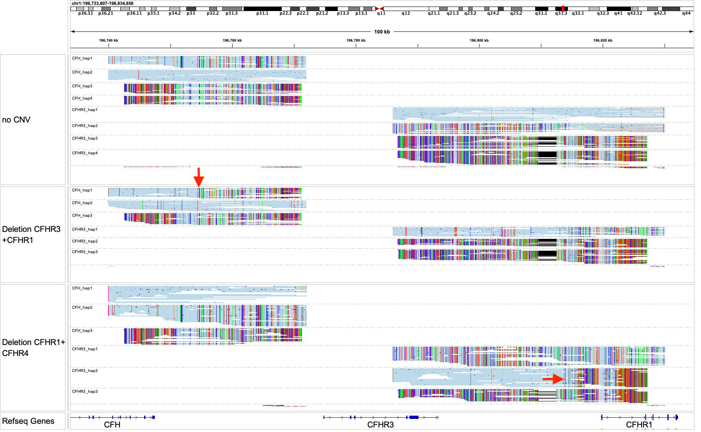

# CFH gene cluster

The CFH gene cluster is a ~250kb genomic region that contains several genes CFH/CFHR1/CFHR2/CFHR3/CFHR4. This region is divided into two pairs of homology regions, where unequal crossing overs can lead to large deletions or duplications. These SVs are related to diseases such as atypical hemolytic uremic syndrome and age-related macular degeneration. Some of these SVs are quite common in the population. 

Paraphase resolves gene copies in two homology regions (named `CFH` and `CFHR3` in the config), and summarizes results under `CFHclust` in the `json` file. Note that only SVs/fusions are called in this region. No VCF is produced, as the sequence similarity is low enough so variant calling should be accurate using standard variant callers.

The `CFH` region contains the end of the CFH gene and the intergenic region between CFH and CFHR3. The `CFHR3` region contains part of CFHR3 all the way to part of CFHR1. In the genome, the order of these homology regions is as follows (also see examples below):

`CFH`, followed by `CFHR3`, followed by `CFH(paralog)`, and followed by `CFHR3(paralog)`.

## Fields in the `json` file

- `fusions_called`: fusions created by deletion or duplication of the region betweeen two breakpoints. Reports the SV type (deletion or duplication) and the breakpoint coordinates.

## Visualizing haplotypes

To visualize phased haplotypes, load the output bam file in IGV, group reads by the `HP` tag and color alignments by `YC` tag. 

Reads in gray are either unassigned or consistent with more than one possible haplotype. When two haplotypes are identical over a region, there can be more than one haplotype consistent with a read, and the read is randomly assigned to a haplotype and colored in gray. 

- The top panel shows a sample with no CNV. Left is the `CFH` region/module analyzed by Paraphase and the right is the `CFHR3` region. Paraphase resolves four copies for each region. In either region, two of the four copies are shorter with more mismatches, representing the paralogs that can no longer align beyond the end of the homology region.
- The middle panel shows a sample with a deletion (`CFH_hap1`) in the `CFH` region (left), where the 5' end is longer and the 3' end is shorter. The red arrow marks the deletion breakpoint. The other side of the breakpoint can be found in the `fusions_called` field under `CFHclust` in the `json`. The `CFHR3` region is covered by the deletion so there are also only three copies found in this region. This SV is a deletion of CFHR3+CFHR1.
- The bottom panel shows a sample with a different deletion (`CFHR3_hap2`) in the `CFHR3` region (right), where the 5' end is longer and the 3' end is shorter. The red arrow marks the deletion breakpoint. The other side of the breakpoint can be found in the `fusions_called` field under `CFHclust` in the `json`. The `CFH` region (the paralogous side) is covered by the deletion so there are also only three copies found in this region. This SV is a deletion of CFHR1+CFHR4 (CFHR4 is the gene downstream of CFHR1).
