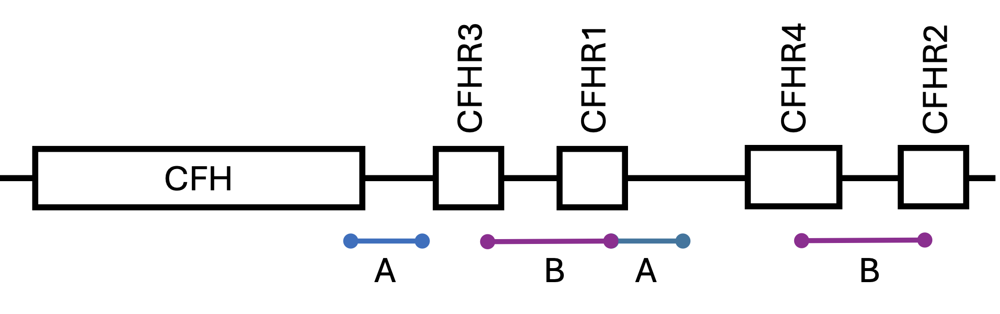
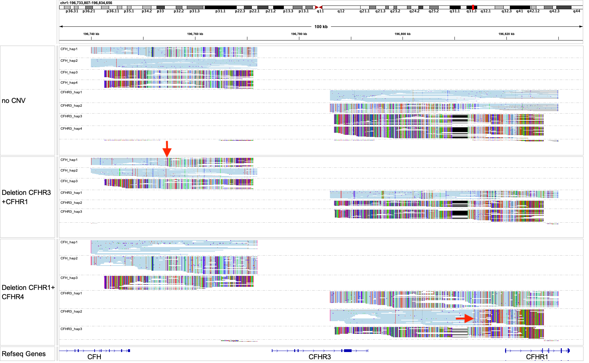

# CFH gene cluster

The CFH gene refers to a ~250kb genomic region on chromosome 1 containing the five genes CFH, CFHR1, CFHR2, CFHR3 and 
CFHR4. This region is divided into two pairs of homology regions, where unequal crossing overs can lead to large 
deletions or duplications. These SVs are related to diseases such as atypical hemolytic uremic syndrome and age-related 
macular degeneration. Some of these SVs are quite common in the population. The simplified schematic of the region bellow 
highlights the two main homology regions "A" and "B".

Paraphase resolves gene copies in the two homology regions (with region "A" named `CFH` and "B" `CFHR3` in the config), 
and summarizes results under `CFHclust` in the `json` file. To analyze this region specifically, use `-g CFH,CFHR3` in 
the command. Note that only SVs/fusions are called in this region. No VCF is produced, as the sequence similarity is 
low enough to allow variant calling with standard variant callers.

## Fields in the `json` file

Fields shared across all genes are defined in the general [json file](json.md). Note that the SVs/fusions will be 
reported in the `fusions_called` field, along with the SV type and the breakpoint coordinates. The CFH locus does not include unique fields.

## Visualizing haplotypes

To visualize phased haplotypes, load the output bam file in IGV, group reads by the `HP` tag and color alignments by `YC` tag. 

Reads in gray are either unassigned or consistent with more than one possible haplotype. When two haplotypes are identical over a region, there can be more than one haplotype consistent with a read, and the read is randomly assigned to a haplotype and colored in gray. 

- The top panel shows a sample with no CNV. Left is the `CFH` region/module analyzed by Paraphase and the right is the `CFHR3` region. Paraphase resolves four copies for each region. In either region, two of the four copies are shorter with more mismatches, representing the paralogs that can no longer align beyond the end of the homology region.
- The middle panel shows a sample with a deletion (`CFH_hap1`) in the `CFH` region (left), where the 5' end is longer and the 3' end is shorter. The red arrow marks the deletion breakpoint. The other side of the breakpoint can be found in the `fusions_called` field under `CFHclust` in the `json`. The `CFHR3` region is covered by the deletion so there are also only three copies found in this region. This SV is a deletion of CFHR3+CFHR1.
- The bottom panel shows a sample with a different deletion (`CFHR3_hap2`) in the `CFHR3` region (right), where the 5' end is longer and the 3' end is shorter. The red arrow marks the deletion breakpoint. The other side of the breakpoint can be found in the `fusions_called` field under `CFHclust` in the `json`. The `CFH` region (the paralogous side) is covered by the deletion so there are also only three copies found in this region. This SV is a deletion of CFHR1+CFHR4 (CFHR4 is the gene downstream of CFHR1).
