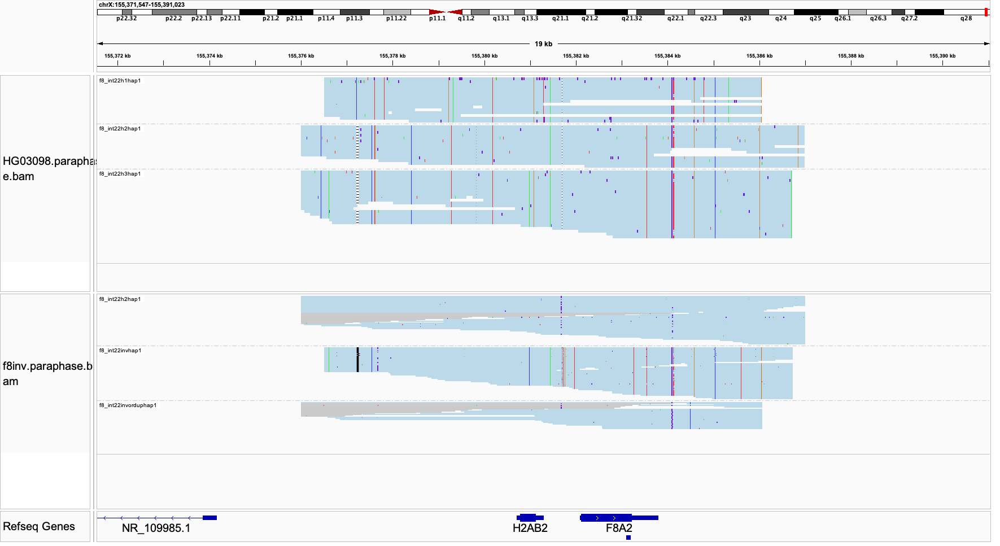

# F8

In F8, our goal is to detect Intron 22 inversion involved in [Hemophilia A](https://www.ncbi.nlm.nih.gov/books/NBK1404/). Paraphase does this by phasing haplotypes for the homology region where inversion breakpoints happen (a region that encodes F8A1, F8A2 and F8A3), and then checking the sequences flanking each haplotype for signals suggesting inversion. Another possible structural variant (SV) in F8, deletion of Exon1-22 (whose breakpoint also falls into the same homology region), is also called by Paraphase, although this variant is relatively easy to call with a standard depth based CNV caller. 

## Fields in the `json` file

- `sv_called`: reports deletion between int22h-1 and int22h-2 (which suggests Exon1-22 deletion), or inversion between int22h-1 and int22h-3 (which suggests Intron 22 inversion)

Note that the inversion and the deletion are also reported in the VCF as SVs. 

## Visualizing haplotypes

To visualize phased haplotypes, load the output bam file in IGV, group reads by the `HP` tag and color alignments by `YC` tag. 

Reads in gray are either unassigned or consistent with more than one possible haplotype. When two haplotypes are identical over a region, there can be more than one haplotype consistent with a read, and the read is randomly assigned to a haplotype and colored in gray. 

In the reference genome, the three homology regions are in the following order: `h1 (forward)`, `h2 (forward)` and `h3 (reverse)`. Recombination between h1 and h3 results in inversion. Recombination between h1 and h2 results in either deletion or duplication.

- The top panel shows a male sample without any SV (three haplotypes expected as this is on chrX. Six haplotypes are expected in female samples). Haplotypes are labeled as h1, h2 and h3, based on their start/end positions. h1, h2 and h3 have unique end positions. h2 and h3 share the same start position, which is different from h1 start position. h2 is the longest haplotype, h1 is the shortest and h3 is in between.
- The bottom panel shows a male sample with an inversion. The recombination happens between h1 and h3, which are in reverse orientation, so there is no copy number change (three haplotypes expected). The recombination results in hybrid haplotypes between h1 and h3, i.e. two haplotypes with either the h1 start position and h3 end position, or the h3 start and h1 end. h2 is unaffected. In this sample, the first haplotype is an h2 haplotype; the second haplotype has h1 start and h3 end, indicating inversion. The third haplotype has h2/h3 start and h1 end; it could be a product of either an inversion (recombination between h1 and h3) or a duplication (recombination between h1 and h2). Since the second haplotype indicates inversion, the third haplotype must be the other breakpoint of the inversion. The third haplotype does not give unambiguous evidence for inversion by itself, so Paraphase only uses the second haplotype (h1 start and h3 end) to call inversion.
- A sample with deletion (not shown here) would have a haplotype that has an h1 start and an h2 end, as well as copy number loss (one copy fewer on each chromosome).
