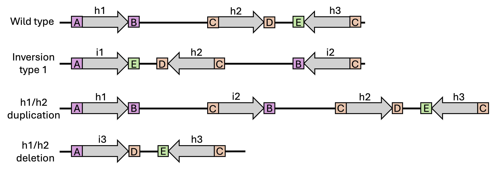
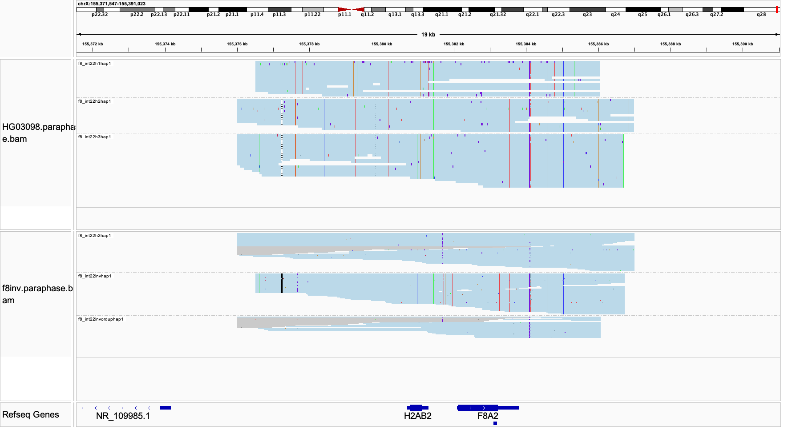

# F8

The F8 gene is located on chromosome X and encodes coagulation factor VIII. Large-scale inversions involving intron 22 
of F8 are a known cause of [Hemophilia A](https://www.ncbi.nlm.nih.gov/books/NBK1404/) and can be detected 
by Paraphase. These inversions occur between regions of homology on the same chromosome.

These regions are regions Int22-h1, Int22-h2 and Int22-h3. On the reference genome, they are in 
the order Int22-h1 (forward), Int22-h2 (forward) and Int22-h3 (reverse). 
  - Recombination between h1 and h3 results in the intron 22 inversion.
  - Recombination between h1 and h2 results in either a deletion or a duplication of the intervening sequence.

Paraphase identifies these events by phasing haplotypes across the homologous regions where the recombination breakpoints 
occur and then examining the sequences flanking each haplotype for evidence consistent with a recombination. The simplified 
schematic bellow (not to scale) illustrates these:

By mapping the reads to a single region, we can recognise and label the haplotypes based on the flanking regions:
- `f8_int22h1hap#`: h1 haplotype
- `f8_int22h2hap#`: h2 haplotype
- `f8_int22h3hap#`: h3 haplotype
- `int22invhap#`: i1 haplotype in the schematic found in the inversion type 1 allele
- `int22invorduphap#`: i2 haplotype in the schematic found in both inversion type 1 and h1/h2 duplication allele
- `int22delhap#`: i3 haplotype in the schematic found in the h1/h2 deletion allele

The h1/h2 deletion, while called by Paraphase, is also relatively easy to call with standard depth based CNV caller. 

## Fields in the `json` file

Fields shared across all genes are defined in the general [json file](json.md). The F8 inversion 22 loci includes 
several unique fields under `region_specific_info`, listed below:
- `sv_called`: h1/h2 deletions and inversions type 1
- `flanking_summary`: contains the matched flanking regions for every haplotype. 
- `exon1_to_exon22_depth`: depth of coverage in the region between exons 1 and 22.

Note that the inversion and the deletion are also reported in the VCF as SVs.

## Visualizing haplotypes

To visualize phased haplotypes, load the output bam file in IGV, group reads by the `HP` tag and color alignments by `YC` tag. 

Reads in gray are either unassigned or consistent with more than one possible haplotype. When two haplotypes are identical over a region, there can be more than one haplotype consistent with a read, and the read is randomly assigned to a haplotype and colored in gray. 

In the reference genome, the three homology regions are in the following order: `h1 (forward)`, `h2 (forward)` and `h3 (reverse)`. Recombination between h1 and h3 results in inversion. Recombination between h1 and h2 results in either deletion or duplication.

- The top panel shows a male sample without any SV (three haplotypes expected as this is on chrX. Six haplotypes are expected in female samples). Haplotypes are labeled as h1, h2 and h3, based on their start/end positions. h1, h2 and h3 have unique end positions. h2 and h3 share the same start position, which is different from h1 start position. h2 is the longest haplotype, h1 is the shortest and h3 is in between.
- The bottom panel shows a male sample with an inversion. The recombination happens between h1 and h3, which are in reverse orientation, so there is no copy number change (three haplotypes expected). The recombination results in hybrid haplotypes between h1 and h3, i.e. two haplotypes with either the h1 start position and h3 end position, or the h3 start and h1 end. h2 is unaffected. In this sample, the first haplotype is an h2 haplotype; the second haplotype has h1 start and h3 end, indicating inversion. The third haplotype has h2/h3 start and h1 end; it could be a product of either an inversion (recombination between h1 and h3) or a duplication (recombination between h1 and h2). Since the second haplotype indicates inversion, the third haplotype must be the other breakpoint of the inversion. The third haplotype does not give unambiguous evidence for inversion by itself, so Paraphase only uses the second haplotype (h1 start and h3 end) to call inversion.
- A sample with deletion (not shown here) would have a haplotype that has an h1 start and an h2 end, as well as copy number loss (one copy fewer on each chromosome).
