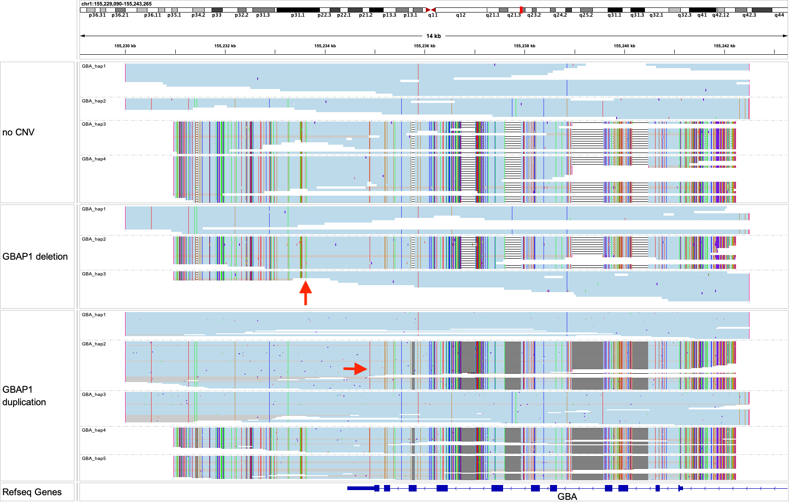

# GBA

Pathogenic variants in GBA cause Gaucher disease and leads to an increased risk of Parkinson’s disease. GBA has sequence homology with its pseudogene GBAP1 particularly in its last three exons, where gene conversion can bring pseudogene-like variants into GBA. Unequal crossing overs can result in fusion genes between GBA and GBAP1.

## Fields in the `json` file

- `fusions_called`: fusions created by deletion or duplication of the region betweeen two breakpoints. Reports the SV type (deletion or duplication) and the breakpoints.

## Visualizing haplotypes

To visualize phased haplotypes, load the output bam file in IGV, group reads by the `HP` tag and color alignments by `YC` tag. 

Reads in gray are either unassigned or consistent with more than one possible haplotype. When two haplotypes are identical over a region, there can be more than one haplotype consistent with a read, and the read is randomly assigned to a haplotype and colored in gray. 

- The top panel shows a sample with two copies of GBA and two copies of GBAP1. The GBAP1 copies are shorter because they can no longer align beyond the end of the homology region.
- The middle panel shows a sample with a deletion (`hap3`), where the 5' end is consistent with the shorter GBAP1 and the 3' end is consistent with the longer GBA. The red arrow marks the deletion breakpoint. The other side of the breakpoint is reported in the `fusions_called` field in the `json`.
- The bottom panel shows a sample with a duplicaton (`hap2`), where the 5' end is consistent with the longer GBA and the 3' end is consistent with the shorter GBAP1. The red arrow marks the duplication breakpoint. The other side of the breakpoint is reported in the `fusions_called` field in the `json`.
