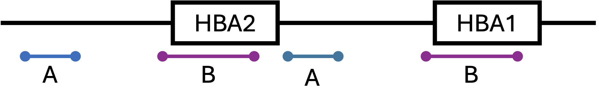
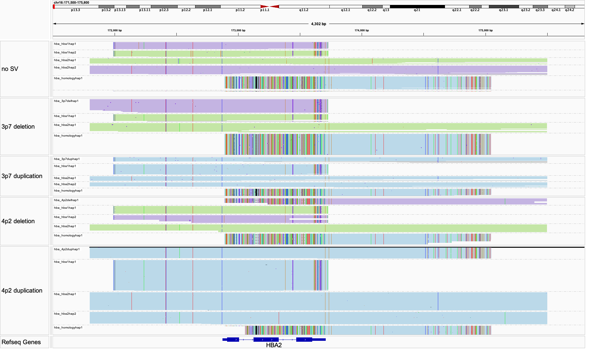

# HBA1/HBA2

This [medically relevant region](https://www.ncbi.nlm.nih.gov/books/NBK1435/), is characterised by two regions of homology, represented by "A" and "B" in this simplified schematic of the region:

Paraphase returns the total copy number of HBA1 and HBA2 in a sample. Variants are called in the VCF relative to the HBA2 reference sequence.

#### Structural Variants

Two well-known structural variants in this region are the **3.7 kb** and **4.2 kb deletions or duplications**, which occur due to unequal crossing-overs between a pair of homology regions:

- **3.7 kb deletion or duplication**  
  Results from recombination between the "B" boxes, forming a hybrid HBA2/HBA1 gene.

- **4.2 kb deletion or duplication**  
  Results from recombination between the "A" boxes, leading to a deletion or duplication of HBA2.

## Fields in the `json` file

Fields shared across all genes are defined in the general [json file](json.md). The region includes several unique fields:

- `genotype`: Reports the genotype for this region. Possible alleles include:
  - `aa`: wild-type
  - `aaa`: duplication
  - `-a`: single-gene deletion
  - `--`: double-gene deletion
- `surrounding_region_depth`: depth in the regions flanking HBA1 and HBA2. Paraphase uses this depth to infer the presence of double-gene deletion. 
- **`sv_called`**: Reports structural variants along with their genome coordinates:
  - `3p7del`: 3.7 kb deletion
  - `3p7dup`: 3.7 kb duplication
  - `4p2del`: 4.2 kb deletion
  - `4p2dup`: 4.2 kb duplication  
  
Haplotype labels are explained in the section below.

## Visualizing haplotypes

To visualize phased haplotypes, load the output bam file in IGV, group reads by the `HP` tag and color alignments by `YC` tag. Green and purple represent two alleles, i.e. all haplotypes in green are on one one allele and all haplotypes in purple are on the other allele. 

Reads in gray are either unassigned or consistent with more than one possible haplotype. When two haplotypes are identical over a region, there can be more than one haplotype consistent with a read, and the read is randomly assigned to a haplotype and colored in gray. 

Paraphase realigns reads to the HBA2 region in the reference genome, including the first "B" box and the second "A" box in the schematic above. Paraphase assigns a label to each haplotype based on the ending (soft-clipped) positions. 

- The `no SV` panel shows a sample with two copies of HBA1 (short) and two copies of HBA2 (long), one on each allele. In addition, there is a `homology_hap` that derives from the first "A" box in the schematic above. The `homology_hap` does not encode any HBA genes and is only used for infering 4.2 kb deletions or duplications, as we can see below.
- The `3p7 deletion` panel shows a sample with a `-a` allele (purple), where there is a 3.7 kb deletion, creating a hybrid haplotype that has an HBA2 start and an HBA1 end (`3p7delhap1`, first haplotype). The genotype is `-a/aa`.
- The `3p7 duplication` panel shows a sample with a 3.7 kb duplication, creating a hybrid haplotype that has an HBA1 start and an HBA2 end (`3p7duphap1`, first haplotype). The genotype is `aaa/aa`. `hba1hap1` is present at two copies, as we can tell from the depth.
- The `4p2 deletion` panel shows a sample with a 4.2 kb deletion, creating a hybrid haplotype with a start correponding to the homology haplotype and an HBA2 end (`4p2delhap1`, first haplotype). It's on the same chromosome as `hba1hap2` (purple). The genotype is `-a/aa`.
- The `4p2 duplication` panel shows a sample with a 4.2 kb duplication, creating a hybrid haplotype with an HBA2 start and an end correponding to the homology haplotype (`4p2duphap1`, first haplotype). The genotype is `aaa/aa`. `hba1hap1` is present at two copies, as we can tell from the depth.