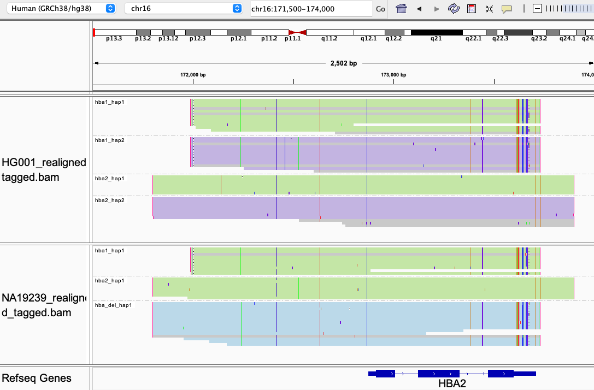

# HBA1/HBA2

For this [region](https://www.ncbi.nlm.nih.gov/books/NBK1435/), Paraphase calls the total copy number of HBA1 and HBA2. Variants are called in the VCF, against HBA2 reference sequence.

## Fields in the `json` file

- `genotype`: reports the genotype of this family. Possible alleles include `aa`, `aaa` (duplication), `-a` (deletion) or `--` (double deletion).
- `alleles_final`: when possible, different copies of HBA are phased into alleles with read based phasing. 
- `sv_called`: reports SVs (3p7del, 3p7dup, 4p2del or 4p2dup) and their coordinates.

## Visualizing haplotypes

To visualize phased haplotypes, load the output bam file in IGV, group reads by the `HP` tag and color alignments by `YC` tag. Green and purple represent two alleles, i.e. all haplotypes in green are on one one allele and all haplotypes in purple are on the other allele. 

Reads in gray are either unassigned or consistent with more than one possible haplotype. When two haplotypes are identical over a region, there can be more than one haplotype consistent with a read, and the read is randomly assigned to a haplotype and colored in gray. 

- The top panel shows a sample with two copies of HBA1 and two copies of HBA2, one on each allele. 
- The bottom panel shows a sample with a `-a` allele, where there is a deletion, leaving only one copy of HBA (`hba_del_hap1`).
