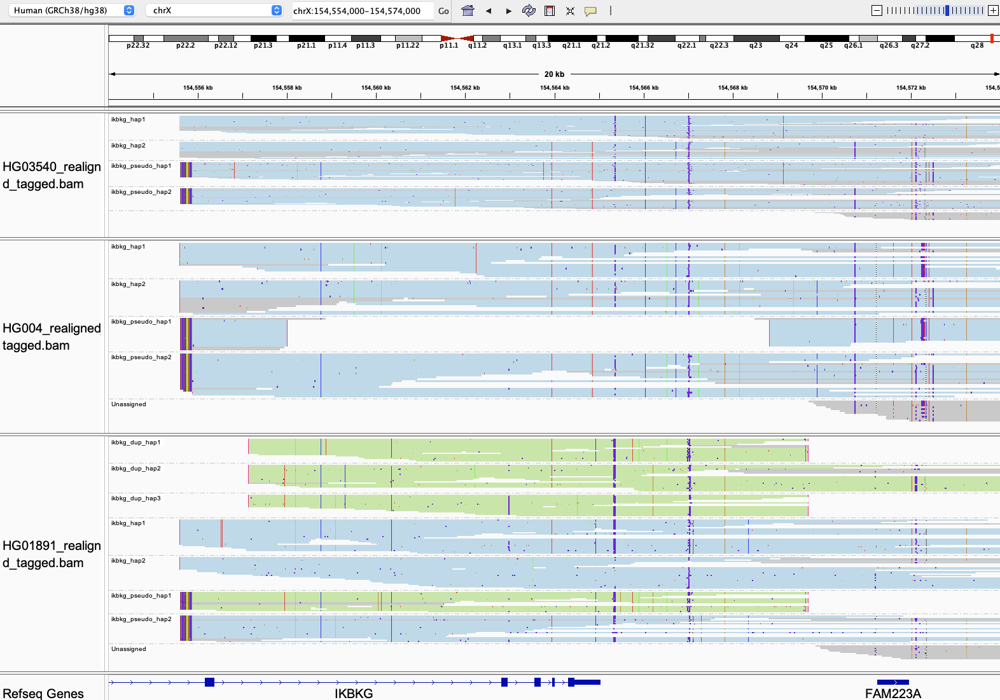

# IKBKG

In this region, Paraphase calls small variants in [IKBKG](https://www.ncbi.nlm.nih.gov/books/NBK1472/). In addition, there is a known 11.7kb deletion that can occur in either IKBKG or the pseudogene. Paraphase calls this deletion and locates it to IKBKG or the pseudogene.

## Fields in the `json` file

- `deletion_haplotypes`: haplotypes carrying the 11.7kb deletion

Note that this deletion is also reported in the VCF as a structural variant (SV). 

## Visualizing haplotypes

To visualize phased haplotypes, load the output bam file in IGV, group reads by the `HP` tag and color alignments by `YC` tag. Reads are realigned to IKBKG. Green represents phased copies on one allele if there is duplication of the 11.7kb region. 

Reads in gray are either unassigned or consistent with more than one possible haplotype. When two haplotypes are identical over a region, there can be more than one haplotype consistent with a read, and the read is randomly assigned to a haplotype and colored in gray. 

- In this set of examples, the top panel shows a female sample without structural variants, i.e. two copies of IKBKG and two copies of IKBKGP1.
- The middle panel shows a female sample with a copy of IKBKGP1 that carries the 11.7kb deletion.
- The bottom panel shows a female sample where there is a duplication (duplicated three times) of the 11.7kb region on a copy of IKBKGP1 (in green).