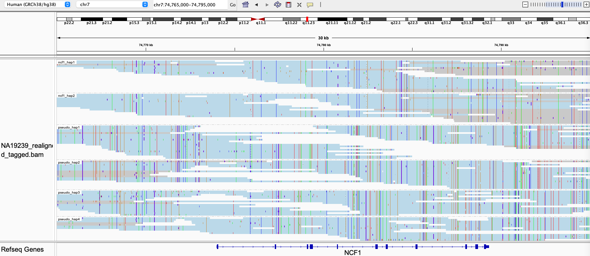

# NCF1

The NCF1 gene and the two NCF1B and NCF1C pseudogenes are located on chromosome 7. NCF1 is associated with chronic 
granulomatous disease and Williams syndrome. The pseudogenes are differentiated from the gene by the presence of a 2bp 
(GT) deletion at the beginning of exon 2, making them nonfunctional ([c.75_76del or p.Tyr26fs](https://www.ncbi.nlm.nih.gov/clinvar/variation/2249/)).

## Fields in the `json` file

Fields shared across all genes are defined in the general [json file](json.md). The NCF1 locus includes the following unique field:
- `gene_reads`: number of reads containing the GT sequence at the beginning of exon 2 characterising the gene.
- `pseudo_reads`: number of reads with the GT deletion characterising the pseudogenes.

## Visualizing haplotypes

To visualize phased haplotypes, load the output bam file in IGV, group reads by the `HP` tag and color alignments by `YC` tag. Reads are realigned to the main gene, NCF1. 

Reads in blue are confidently consistent with a single haplotype. Reads in gray are either unassigned or consistent with more than one possible haplotype. When two haplotypes are identical over a region, there can be more than one haplotype consistent with a read, and the read is randomly assigned to a haplotype and colored in gray. 

