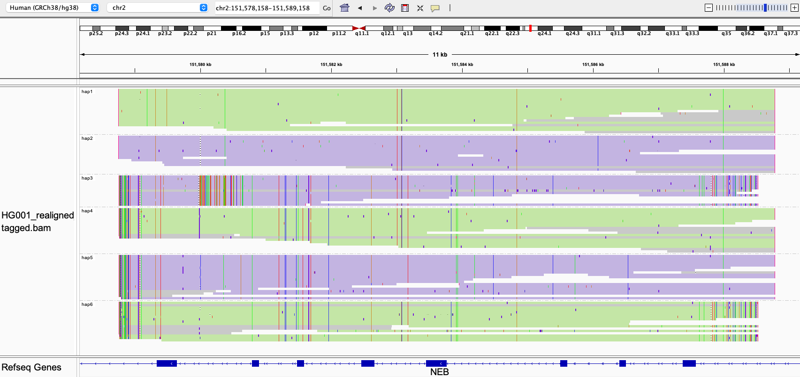

# NEB

Paraphase resolves the triplicate (TRI) repeat region in NEB, where copy number variants are common. 

## Fields in the `json` file

- `total_cn`: total copy number of the triplicate repeat
- `two_copy_haplotypes`: haplotypes that are present in two copies based on depth. This happens when (in a small number of cases) two haplotypes are identical and we infer that there exist two of them instead of one by checking the read depth.
- `alleles_final`: when possible, different copies of TRI are phased into alleles with read based phasing. 

## Visualizing haplotypes

To visualize phased haplotypes, load the output bam file in IGV, group reads by the `HP` tag and color alignments by `YC` tag. Reads are realigned to the first copy of TRI in the reference genome.

Green and purple represent two alleles, i.e. all haplotypes in green are on one one allele and all haplotypes in purple are on the other allele. Reads in gray are either unassigned or consistent with more than one possible haplotype. When two haplotypes are identical over a region, there can be more than one haplotype consistent with a read, and the read is randomly assigned to a haplotype and colored in gray. 

This example has three copies of TRI on one allele and another three copies of TRI on the other allele.
