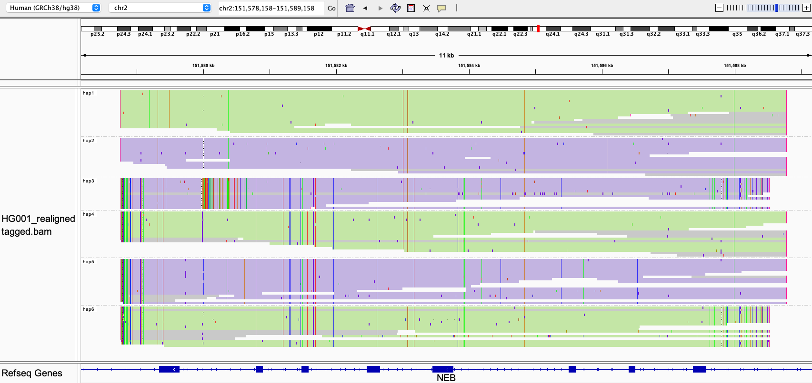

# NEB

The NEB gene is located on chromosome 2 and contains the NEB triplicate (TRI) region, normally consisting of three 
groups of exons: TRI1 (exons 82-89), TRI2 (exons 90-97), and TRI3 (98-105). The gene codes for the nebulin protein, and 
increases in copy number of the TRI regions is associated with Nemaline myopathy.

Paraphase resolves the copy number of the TRI regions. 

## Fields in the `json` file

Fields shared across all genes are defined in the general [json file](json.md). The NEB locus includes the following unique field:
- `repeat_name`: haplotypes are assigned to TRI1/TRI2/TRI3. Note that the reported order is according to the reference 
genome, i.e. the first copy of the repeat in the reference genome is TRI1 and the last copy is TRI3. Some studies assign 
the labels according to the order in the coding sequence, which is on the reverse strand of the reference genome and thus 
uses the opposite order to Paraphase.

## Visualizing haplotypes

To visualize phased haplotypes, load the output bam file in IGV, group reads by the `HP` tag and color alignments by `YC` tag. Reads are realigned to the first copy of TRI in the reference genome.

Green and purple represent two alleles, i.e. all haplotypes in green are on one one allele and all haplotypes in purple are on the other allele. Reads in gray are either unassigned or consistent with more than one possible haplotype. When two haplotypes are identical over a region, there can be more than one haplotype consistent with a read, and the read is randomly assigned to a haplotype and colored in gray. 

This example has three copies of TRI on one allele and another three copies of TRI on the other allele.
