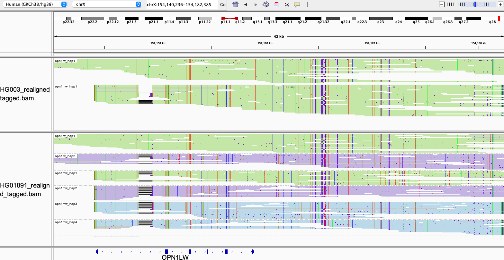

# OPN1LW/OPN1MW

For [this region](https://medlineplus.gov/genetics/gene/opn1lw/), Paraphase resolves all OPN1LW/OPN1MW copies in a sample, phases them to identify the first two copies on each allele (as only the first two copies in the array are expressed) and annotates them as OPN1LW or OPN1MW (also annotates known variants). Color vision deficiencies could then be inferred based on Paraphase calls.

## Fields in the `json` file

- `total_cn`: total copy number of OPN1LW/OPN1MW
- `two_copy_haplotypes`: haplotypes that are present in two copies based on depth. This happens when (in a small number of cases) two haplotypes are identical and we infer that there exist two of them instead of one by checking the read depth.
- `annotated_haplotypes`: annotates each haplotype against known pathogenic variants, as summarized in [Neitz et al. 2021](https://www.mdpi.com/2073-4425/12/8/1180).
- `alleles_final`: first two haplotypes on each allele, phased with read based phasing. 
- `annotated_alleles`: final allele annotation, reporting the first two genes on each allele, together with any known pathogenic variants. Occasionally, a `null` call (no-call) for the second copy on an allele indicates that Paraphase could not confidently identify the second copy.

## Visualizing haplotypes

To visualize phased haplotypes, load the output bam file in IGV, group reads by the `HP` tag and color alignments by `YC` tag. Reads are realigned to OPN1LW.

Green and purple represent two alleles (only the first two copies in this case), i.e. haplotypes in green are on one one allele and haplotypes in purple are on the other allele. Reads in gray are either unassigned or consistent with more than one possible haplotype. When two haplotypes are identical over a region, there can be more than one haplotype consistent with a read, and the read is randomly assigned to a haplotype and colored in gray. 

- The top panel shows a simple male sample with a single X allele (green), on which there is a copy of OPN1LW followed by a copy of OPN1MW.
- The bottom panel shows a female sample with six copies of this repeat. One allele (green) starts with `opn1lw_hap1` followed by `opn1mw_hap1`, and the other allele (purple) starts with `opn1lw_hap2` followed by `opn1mw_hap2`. The remaining two copies are third or fourth on an allele, so they are not expressed. As a result, they are not biologically meaningful and hence not annotated by Paraphase. 

