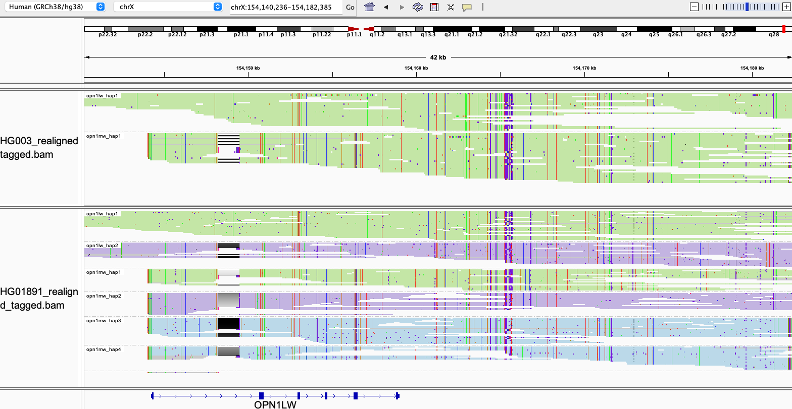

# OPN1LW/OPN1MW

The [OPN1LW](https://medlineplus.gov/genetics/gene/opn1lw/) and [OPN1MW](https://medlineplus.gov/genetics/gene/opn1mw/) genes are highly similar genes located on chromosome X. They encode opsins that are sensitive to light of different wavelengths. Recombination between the 
two regions can cause different types of color vision deficiencies.

Of note: only the first two copies of the OPN1LW/OPN1MW genes on each allele are expressed, generally corresponding to 
the OPN1LW gene and to the first copy of the OPN1MW gene.

Paraphase resolves all OPN1LW/OPN1MW copies in a sample, phases them to identify the first two copies on each allele and 
annotates the copies as either OPN1LW or OPN1MW. Paraphase also annotates known variants on these genes.

## Fields in the `json` file

Fields shared across all genes are defined in the general [json file](json.md). The OPN1LW/OPN1MW locus includes the following unique field:
- `opn1lw_cn`: total copy number of OPN1LW
- `opn1mw_cn`: total copy number of OPN1MW
- `annotated_haplotypes`: annotates each haplotype against known pathogenic variant sites of Exon 3, as summarized in
[Neitz et al. 2021](https://www.mdpi.com/2073-4425/12/8/1180). The annotated variant amino acid positions are p.153, 
p.171, p.174, p.178, and p.180, reported using the single letter code to indicate the amino acids specified at each 
position. Please refer to the linked publication for detailed information.
- `annotated_alleles`: final allele annotation, reporting the first two genes on each allele, together with annotations at known pathogenic variant sites of Exon 3. Occasionally, a `null` call (no-call) for the second copy on an allele indicates that Paraphase 
could not confidently identify the second copy.
- `first_copies`, `last_copies`, `middle_copies`, `directional_links`, `links_loose`: these fields are used internally 
to determine the order of genes on each allele and can be ignored.

The OPN1LW haplotypes are labeled `opn1lw_opn1lwhap#` and OPN1MW `opn1lw_opn1mwhap#`.

## Visualizing haplotypes

To visualize phased haplotypes, load the output bam file in IGV, group reads by the `HP` tag and color alignments by 
`YC` tag. Reads are realigned to OPN1LW.

Green and purple represent two alleles (only the first two copies in this case), i.e. haplotypes in green are on one one allele and haplotypes in purple are on the other allele. Reads in gray are either unassigned or consistent with more than one possible haplotype. When two haplotypes are identical over a region, there can be more than one haplotype consistent with a read, and the read is randomly assigned to a haplotype and colored in gray. 

- The top panel shows a simple male sample with a single X allele (green), on which there is a copy of OPN1LW followed by a copy of OPN1MW.
- The bottom panel shows a female sample with six copies of this repeat. One allele (green) starts with `opn1lw_hap1` followed by `opn1mw_hap1`, and the other allele (purple) starts with `opn1lw_hap2` followed by `opn1mw_hap2`. The remaining two copies are third or fourth on an allele, so they are not expressed. As a result, they are not biologically meaningful and hence not annotated by Paraphase. 

