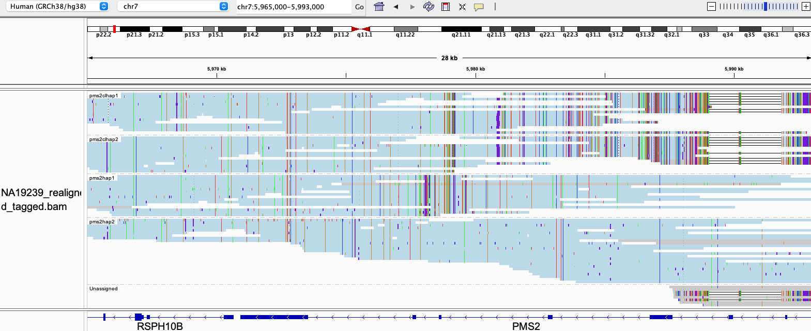

# PMS2

## Fields in the `json` file

Fields shared across all genes are defined in the general json [file](json.png). PMS2 does not include unique fields.

The PMS2 haplotypes are labeled as gene (labelled `pms2_pms2hapx`) and pseudogene (labelled `pms2_pms2clhapx`) based on 
whether the haplotype is truncated in the 3' end

## Visualizing haplotypes

To visualize phased haplotypes, load the output bam file in IGV, group reads by the `HP` tag and color alignments by `YC` tag. Reads are realigned to PMS2.

Reads in blue are confidently consistent with a single haplotype. Reads in gray are either unassigned or consistent with more than one possible haplotype. When two haplotypes are identical over a region, there can be more than one haplotype consistent with a read, and the read is randomly assigned to a haplotype and colored in gray. 

