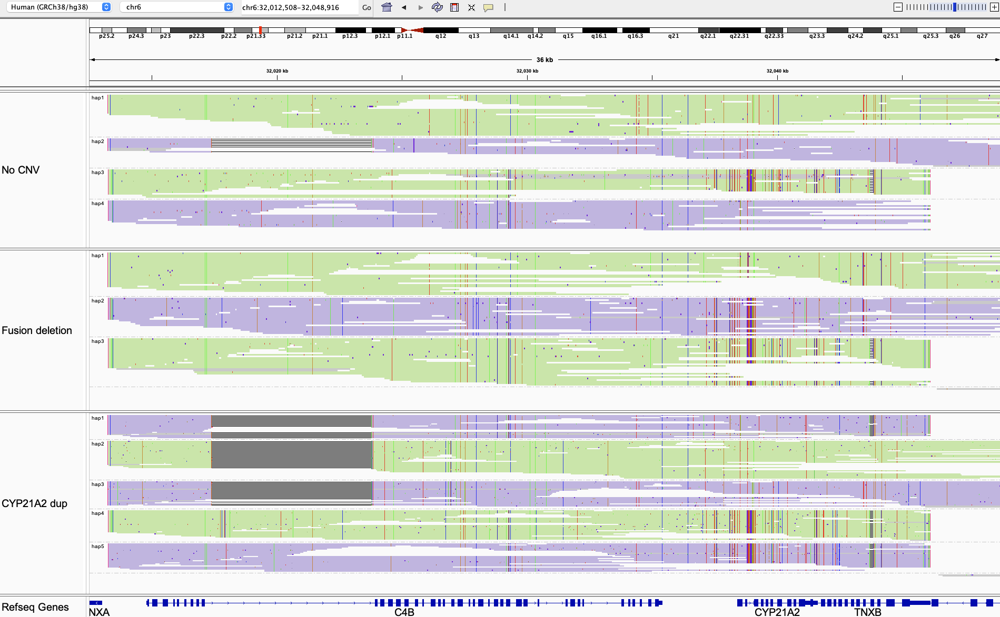

# RCCX module

Medically relevant genes in this region include:
  - [CYP21A2](https://www.ncbi.nlm.nih.gov/books/NBK1171/) (21-Hydroxylase-Deficient Congenital Adrenal Hyperplasia)
  - TNXB (Ehlers-Danlos syndrome)
  - C4A/C4B (relevant in autoimmune diseases)

## Fields in the `json` file

- `total_cn`: total copy number of RCCX
- `two_copy_haplotypes`: haplotypes that are present in two copies based on depth. This happens when (in a small number of cases) two haplotypes are identical and we infer that there exist two of them instead of one by checking the read depth.
- `alleles_final`: different copies of RCCX are phased into alleles with read based phasing. 
- `ending_hap`: the last copy of RCCX on each allele. Only these copies contain parts of TNXB (while the other copies contain TNXA)
- `annotated_alleles`: allele annotation for the CYP21A2 gene. This is a list of two items, each representing one allele in the sample. This is only based on common gene-pseudogene (CYP21A2-CYP21A1P) differences (P31L, IVS2-13A/C>G, G111Vfs, I173N, I237N, V238E, M240K, V282L, Q319X and R357W). Please refer to the VCFs for most thorough variant calling and annotation. Below are a few examples of annotated alleles:
  - `WT`: one copy of CYP21A2 and one copy of CYP21A1P (pseudogene) on this allele. 
  - `pseudogene_duplication`: On this allele, there is an additional copy of the pseudogene. 
  - `pseudogene_deletion`: On this allele, the pseudogene is deleted. 
  - `gene_duplication`: On this allele, there is an additional copy of CYP21A2. 
  - `gene_deletion`: On this allele, CYP21A2 is deleted.
  - `deletion_P31L,G111Vfs`: On this allele, there is a deletion of one RCCX copy, creating a fusion gene between CYP21A1P and CYP21A2. This fusion gene carries the variants P31L and G111Vfs (which come from the pseudogene part of the fusion). 
  - `duplication_WT_plus_Q319X`: On this allele, there is an additional copy of CYP21A2. Among the two copies of CYP21A2, one copy is WT and the other carries Q319X.
  - `Q319X`: On this allele, there is no CNV, i.e. there is one copy of CYP21A2 and one copy of CYP21A1P. CYP21A2 carries the variant Q319X. (Other known variants in CYP21A2 are also reported in this way, e.g. `282L`.)

## Visualizing haplotypes

To visualize phased haplotypes, load the output bam file in IGV, group reads by the `HP` tag and color alignments by `YC` tag. Reads are realigned to CYP21A2.

Green and purple represent two alleles, i.e. all haplotypes in green are on one one allele and all haplotypes in purple are on the other allele. Reads in gray are either unassigned or consistent with more than one possible haplotype. When two haplotypes are identical over a region, there can be more than one haplotype consistent with a read, and the read is randomly assigned to a haplotype and colored in gray. 

- In this set of examples, the top panel shows a sample with no copy number change (both alleles are `WT`). There are four copies of RCCX, two on each allele. On each allele, one copy carries CYP21A2 and the other copy carries CYP21A1P (marked by a cluster of mismatches when aligned to CYP21A2).
- The middle panel shows a sample with a fusion deletion (purple allele `deletion_P31L,G111Vfs`). There is only one copy of RCCX on this allele. The deletion breakpoint is in CYP21A2, creating a fusion gene between CYP21A1P and CYP21A2.
- The bottom panel shows a sample with a CYP21A2 duplication that carries Q319X (purple allele `duplication_WT_plus_Q319X`). On this allele, there are two copies of CYP21A2, among which one copy is WT and the other (the one next to TNXB) carries Q319X.

