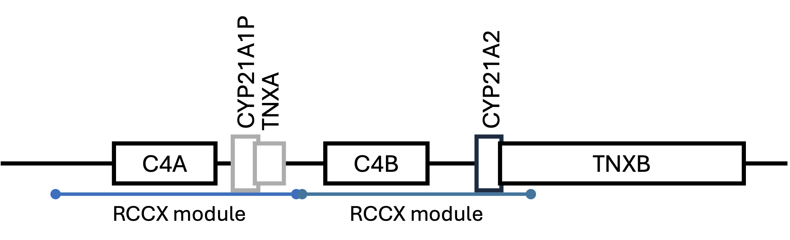
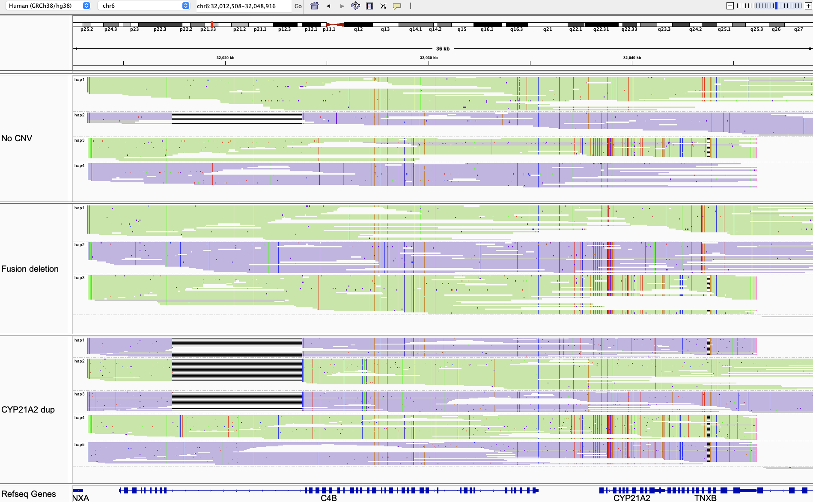

# RCCX module

The RCCX module refers to a complex and variable region on chromosome 6, overlapping several medically relevant genes, including:
- [CYP21A2](https://www.ncbi.nlm.nih.gov/books/NBK1171/) (21-Hydroxylase-Deficient Congenital Adrenal Hyperplasia)
- TNXB (Ehlers-Danlos syndrome)
- C4A/C4B (relevant in autoimmune diseases)

Below is a simplified schematic of the region:

## Region specific fields in the `json` file

Fields shared across all genes are defined in the general [json file](json.md). The RCCX module includes several unique fields, listed below:

- `ending_hap`: Indicates the last RCCX copy on each allele. These haplotypes have unique sequences from the unique region downstream of RCCX. Only these final copies contain the gene TNXB; all earlier copies on the same haplotype contain TNXA (the pseudogene). This field can be used to infer the order of RCCX haplotypes on an allele.
- `starting_hap`: Indicates the first RCCX copy on each allele. These haplotypes have unique sequences from the unique region upstream of RCCX. This field can be used to infer the order of RCCX haplotypes on an allele.
- `deletion_hap`: a deletion haplotype has the characteristics of both a starting haplotype and an ending haplotype, indicating that it's the only haplotype on an allele, indicating a deletion of an RCCX copy, leaving just one copy of RCCX.
- `hap_variants`: Variant calls for common gene-pseudogene (CYP21A2-CYP21A1P) differentiating sites (P31L, IVS2-13A/C>G, G111Vfs, I173N, I237N, V238E, M240K, V282L, Q319X and R357W). This is used for allele annotation of CYP21A2. For comprehensive variant calls of the RCCX module please refer to the vcf file.
- `phasing_success`: Indicates whether the different haplotypes could be phased into alleles. Note that this does not refer to haplotype phasing itself; haplotype can still be resolved even if they cannot be connected into alleles.
- `annotated_alleles`: Provides per-allele annotations of CYP21A2 based on the `hap_variants` field. Possible values may include:
  - `WT`: one copy each of CYP21A2 and CYP21A1P (pseudogene) on this allele. 
  - `pseudogene_duplication`: additional copy of CYP21A1P on this allele.
  - `pseudogene_deletion`: CYP21A1P is deleted on this allele.
  - `gene_duplication`: additional copy of CYP21A2 on this allele.
  - `gene_deletion`: CYP21A2 is deleted on this allele.
  - `deletion_P31L,G111Vfs`: Deletion of one RCCX copy on this allele, creating a CYP21A1P–CYP21A2 fusion gene carrying P31L and G111Vfs variants from the pseudogene.
  - `duplication_WT_plus_Q319X`: Two copies of CYP21A2 on this allele: one WT, the other carrying Q319X.
  - `Q319X`: Single CYP21A2 copy with variant Q319X, no CNV present (other variants like 282L are reported similarly).

## Visualizing haplotypes

To visualize phased haplotypes, load the output bam file in IGV, group reads by the `HP` tag and color alignments by `YC` tag. Reads are realigned to the CYP21A2 reference.

Green and purple represent two alleles, i.e. all haplotypes in green are on one allele and all haplotypes in purple are on the other allele. Reads in gray are either unassigned or consistent with more than one possible haplotype. When two haplotypes are identical over a region, there can be more than one haplotype consistent with a read, and the read is randomly assigned to a haplotype and colored in gray. 

Examples:
- **Top panel**: Sample with no copy number change (both alleles are `WT`). There are four copies of RCCX, two per allele. Each allele carries CYP21A2 and CYP21A1P (marked by a cluster of mismatches when aligned to CYP21A2).
- **Middle panel**: sample with a fusion deletion on the purple allele (`deletion_P31L,G111Vfs`). This allele has only one RCCX copy. The breakpoint occurs within CYP21A2, creating a CYP21A1P–CYP21A2 fusion gene that includes variants inherited from the pseudogene.
- **Bottom panel**: shows a sample with a CYP21A2 duplication on the purple allele (`duplication_WT_plus_Q319X`). This allele contains two CYP21A2 copies. One is wild-type; the other (next to TNXB) carries the Q319X variant.

