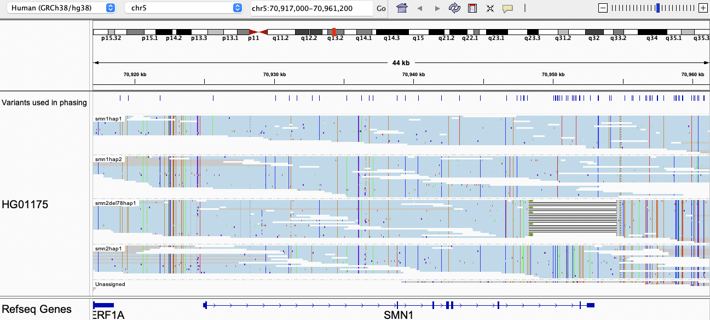
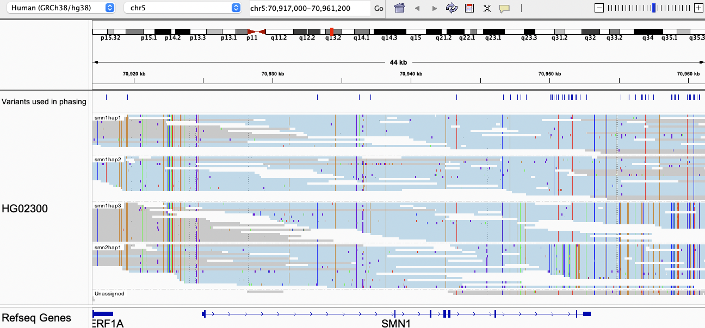
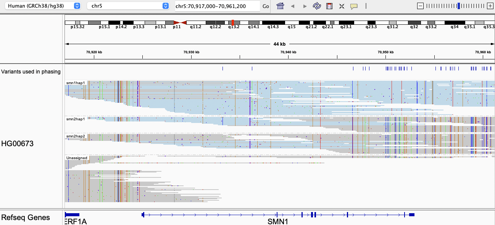

# SMN1 and SMN2

SMN1 and SMN2 are two highly similar genes located on chromosome 5. Both genes encode the Survival Motor Neuron (SMN) 
protein. However, while SMN1 produces a functional protein, the c.840C>T point mutation in SMN2 alters splicing regulation, 
leading to frequent exon 7 skipping and truncated protein products, with only a small fraction of functional protein produced.

Paraphase differentiates SMN1 from SMN2 based on the presence of the c.840C>T point mutation. It then calls variants in
each haplotype against the appropriate reference region: the SMN1 region for haplotypes without the c.840C>T mutation
and the SMN2 region for haplotypes carrying the mutation.

Additionally, paraphase recognises the SMNΔ7–8 deletion haplotype, which corresponds to SMN with a deletion of exon7-8.

## Fields in the `json` file

Fields shared across all genes are defined in the general [json file](json.md). The SMN1/2 locus includes several unique fields, listed below:

- `smn1_cn`: copy number of SMN1, a `null` call indicates that Paraphase finds only one haplotype but depth does not unambiguously support a copy number of one or two.
- `smn2_cn`: copy number of SMN2, a `null` call indicates that Paraphase finds only one haplotype but depth does not unambiguously support a copy number of one or two.
- `smn_del78_cn`: copy number of SMNΔ7–8
- `smn1_read_number`: number of reads containing c.840C
- `smn2_read_number`: number of reads containing c.840T
- `smn_del78_read_number`: number of reads containing the known deletion of Exon7-8 on SMN
- `smn1_haplotypes`: phased SMN1 haplotypes
- `smn2_haplotypes`: phased SMN2 haplotypes
- `smn_del78_haplotypes`: phased SMNΔ7–8 haplotypes
- `haplotype_details`: In addition to the standard information, this field contains SMN1/SMN2-specific fields:
  - `haplogroup`: SMN1/SMN2 haplogroup to which the haplotype is assigned, as defined in our [paper](https://www.cell.com/ajhg/fulltext/S0002-9297(23)00001-0).

## Visualizing haplotypes

To visualize phased haplotypes, load the output bam file in IGV, group reads by the `HP` tag and color alignments by 
`YC` tag. Reads are realigned to the SMN1 reference.

### Example 1

In this example, there are two copies of SMN1, one copy of SMNΔ7–8, and one copy of intact SMN2. All reads are realigned to SMN1. Polymorphic sites used for phasing/assembling haplotypes are shown in the top panel. The `Unassigned` category contains reads that carry bases that do not support any haplotypes (this could be due to sequencing errors or partially phased haplotypes).

### Example 2

In this example, there are three copies of SMN1 and one copy of SMN2. Reads in blue are uniquely assigned to a haplotype. Reads in gray are consistent with more than one possible haplotype (this happens when those haplotypes are identical over a region). Here `smn1hap1`, `smn1hap3` and `smn2hap1` are identical from the region upstream of SMN1 all the way to halfway into Intron 1 (their sequences are identical at the first two variant sites). When there are several possible haplotypes consistent with a read, the read is randomly assigned to a haplotype and colored in gray. 

### Example 3

In this example, Paraphase assembles one SMN1 haplotype and two SMN2 haplotypes. The depth of `smn1hap1` suggests that it is present in two copies, so Paraphase infers that there are two copies of SMN1 (their haplotype sequences are identical). Note that the majority of the `Unassigned` reads are "unassigned" because they do not overlap any polymorphic site.

For more examples on SMN1/SMN2, IGV session files for 107 Coriell samples can be downloaded from [here](https://github.com/xiao-chen-xc/SMN_phased_data).
