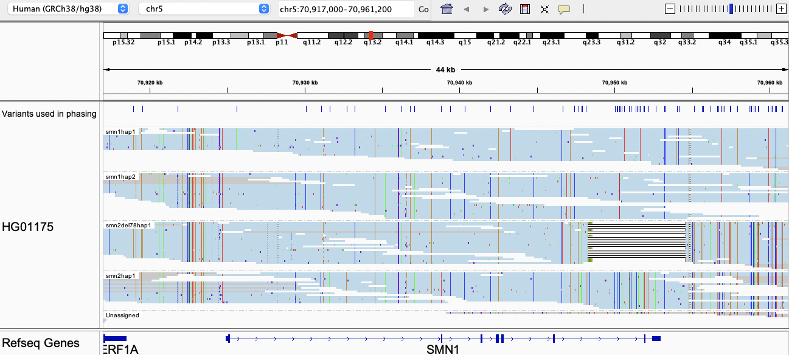

# SMN1 and SMN2

## Fields in the `json` file

- `smn1_cn`: copy number of SMN1, a `null` call indicates that Paraphase finds only one haplotype but depth does not unambiguously support a copy number of one or two.
- `smn2_cn`: copy number of SMN2, a `null` call indicates that Paraphase finds only one haplotype but depth does not unambiguously support a copy number of one or two.
- `smn2_del78_cn`: copy number of SMN2Δ7–8 (SMN2 with a deletion of Exon7-8)
- `smn1_read_number`: number of reads containing c.840C
- `smn2_read_number`: number of reads containing c.840T
- `smn2_del78_read_number`: number of reads containing the known deletion of Exon7-8 on SMN2
- `smn1_haplotypes`: phased SMN1 haplotypes
- `smn2_haplotypes`: phased SMN2 haplotypes
- `smn2_del78_haplotypes`: phased SMN2Δ7–8 haplotypes
- `two_copy_haplotypes`: haplotypes that are present in two copies based on depth. This happens when (in a small number of cases) two haplotypes are identical and we infer that there exist two of them instead of one by checking the read depth.
- `haplotype_details`: lists information about each haplotype 
  - `boundary`: The boundary of the region that is resolved on the haplotype. This is useful when a haplotype is only partially phased.
  - `haplogroup`: The haplogroup that the haplotype is assigned to

## Visualizing haplotypes

We can visualize the haplotypes by loading the output bam file into IGV and grouping reads by the `HP` tag (also color alignments by `YC` tag).

### Example 1

In this example, there are two copies of SMN1, one copy of SMN2Δ7–8, and one copy of intact SMN2. All reads are aligned to SMN1. Polymorphic sites used for phasing/assembling haplotypes are shown in the top panel. The `Unassigned` category contains reads that carry bases that do not agree with any haplotypes (this could be due to sequencing errors or short haplotypes).

### Example 2

In this example, there are three copies of SMN1 and one copy of SMN2. Reads in blue are uniquely assigned to a haplotype. Reads in gray are consistent with more than one possible haplotype (this happens when those haplotypes are identical over a region). Here `smn1hap1`, `smn1hap3` and `smn2hap1` are identical from the region upstream of SMN1 all the way to halfway into Intron 1 (their sequences are identical at the first two variant sites). When there are several possible haplotypes consistent with a read, the read is randomly assigned to a haplotype and colored in gray. 

### Example 3

In this example, Paraphase assembles one SMN1 haplotype and two SMN2 haplotypes. The depth of `smn1hap1` suggests that it is present in two copies, so Paraphase infers that there are two copies of SMN1 (their haplotype sequences are identical). Note that the majority of the `Unassigned` reads are "unassigned" because they do not overlap any polymorphic site.

For more examples, IGV session files for 107 Coriell samples can be downloaded from [here](https://github.com/xiao-chen-xc/SMN_phased_data).
