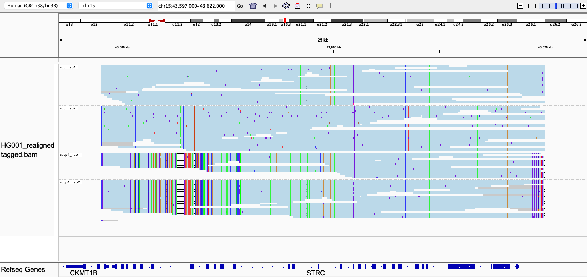

# STRC

## Fields in the `json` file

- `total_cn`: total copy number of STRC and STRCP1
- `gene_cn`: copy number of the gene of interest, i.e. STRC
- `two_copy_haplotypes`: haplotypes that are present in two copies based on depth. This happens when (in a small number of cases) two haplotypes are identical and we infer that there exist two of them instead of one by checking the read depth.

## Visualizing haplotypes

To visualize phased haplotypes, load the output bam file in IGV, group reads by the `HP` tag and color alignments by `YC` tag. Reads are realigned to STRC.

Reads in blue are confidently consistent with a single haplotype. Reads in gray are either unassigned or consistent with more than one possible haplotype. When two haplotypes are identical over a region, there can be more than one haplotype consistent with a read, and the read is randomly assigned to a haplotype and colored in gray. 

This example has two copies of STRC and two copies of STRCP1.