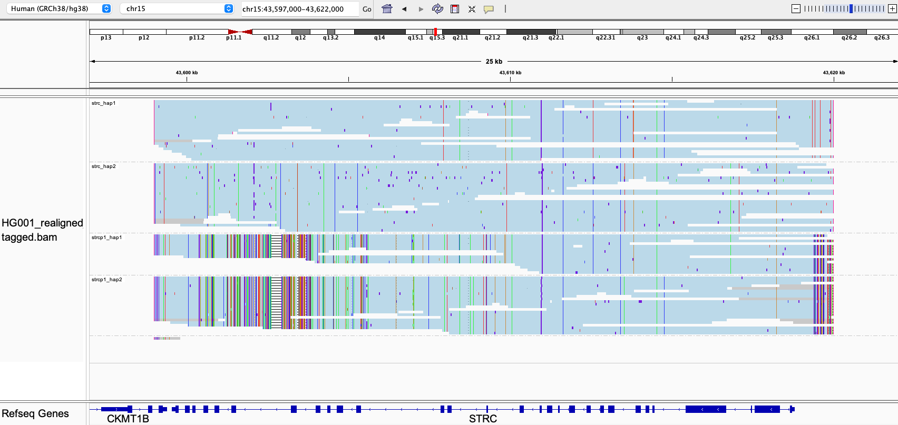

# STRC

The STRC gene and STRCP1 pseudogene are located on chromosome 15. Mutations in STRC are associated with hearing loss.

Paraphase differentiates STRC from the pseudogene based on the presence of a known 314bp deletion located between exon 
23 and 24 in the pseudogene.

## Fields in the `json` file

Fields shared across all genes are defined in the general [json file](json.md). The STRC locus includes the following unique field:
- `intergenic_depth`: Coverage depth at the `depth_region` defined in the configuration file, corresponding to the region
  between the gene and the haplotype. This value is used to help identify gene fusions, where deletion of the intergenic
  region results in an intergenic depth comparable to that of a single haplotype.

## Visualizing haplotypes

To visualize phased haplotypes, load the output bam file in IGV, group reads by the `HP` tag and color alignments by `YC` tag. Reads are realigned to STRC.

Reads in blue are confidently consistent with a single haplotype. Reads in gray are either unassigned or consistent with more than one possible haplotype. When two haplotypes are identical over a region, there can be more than one haplotype consistent with a read, and the read is randomly assigned to a haplotype and colored in gray. 

This example has two copies of STRC and two copies of STRCP1.