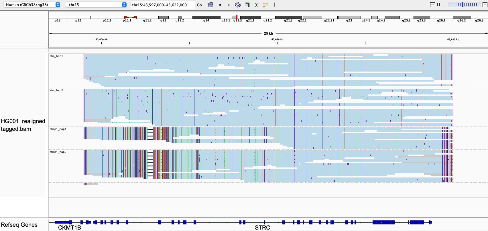

# STRC

The STRC gene and STRCP1 pseudogene are located on chromosome 15. Mutations in STRC are associated with hearing loss.

Paraphase differentiates STRC from the pseudogene using two configured identity markers: the pivot SNV and a known 314bp deletion located between exons 23 and 24 in the pseudogene. A haplotype is labeled as STRC or STRCP1 only when both markers agree. If either marker is missing or the markers disagree, the haplotype is labeled `unknownhap` and `gene_cn` is reported as `null`; `total_cn` is retained when it can still be inferred independently. Haplotype variants without a confident locus assignment are omitted from the default two-reference VCF. With the explicit `--gene1only` option, all haplotypes are instead projected onto the STRC reference and retain their haplotype names. An `unknownhap` label does not by itself establish a gene-conversion or hybrid allele and should be reviewed using the phased reads and orthogonal evidence.

## Fields in the `json` file

Fields shared across all genes are defined in the general [json file](json.md). The STRC locus includes the following unique field under `region_specific_info`:
- `intergenic_depth`: Coverage depth at the `depth_region` defined in the configuration file, corresponding to the region between STRC and STRCP1. This value is used to help identify deletions. A deletion of one copy of STRC or STRCP1 is associated with a deletion of the intergenic region, where the intergenic depth becomes comparable to the genome haploid depth.
- `gene_cn`: STRC copy number when every assembled haplotype has a confident STRC or STRCP1 identity. This value is `null` when any haplotype has missing or discordant identity-marker evidence.

## Visualizing haplotypes

To visualize phased haplotypes, load the output bam file in IGV, group reads by the `HP` tag and color alignments by `YC` tag. Reads are realigned to STRC.

Reads in blue are confidently consistent with a single haplotype. Reads in gray are either unassigned or consistent with more than one possible haplotype. When two haplotypes are identical over a region, there can be more than one haplotype consistent with a read, and the read is randomly assigned to a haplotype and colored in gray. 

This example has two copies of STRC and two copies of STRCP1.
