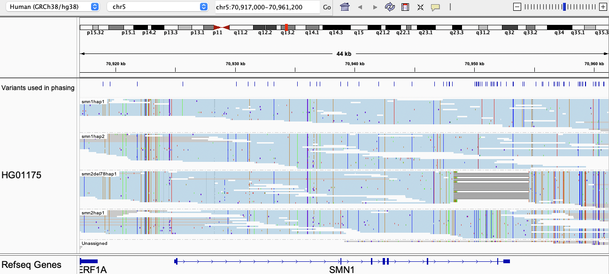

# Paraphase demo

Perform a quick Paraphase run with the following dataset and commands.

```bash
# Download human GRCh38 if you don't have one
wget https://downloads.pacbcloud.com/public/reference-genomes/human_GRCh38_no_alt_analysis_set.tar.2023-12-04.gz
tar -xpvf human_GRCh38_no_alt_analysis_set.tar.2023-12-04.gz
# Get demo input BAM by cloning the Paraphase repo
git clone https://github.com/PacificBiosciences/paraphase
# Run Paraphase for the SMN1/SMN2 region
paraphase -b ./paraphase/tests/test_data/HG01175_smn1_extracted.bam -r ./human_GRCh38_no_alt_analysis_set/human_GRCh38_no_alt_analysis_set.fasta -o ./output/ -p HG01175 -g smn1
```

Note that a warning message `For sample HG01175, due to low or highly variable genome coverage, genome coverage is not used for depth correction` is expected as this test dataset is not a WGS BAM, but a bamlet extracted from the original WGS BAM. If you would like to run the full WGS BAM for this sample, it can be downloaded from:
```bash
# BAM
wget https://s3-us-west-2.amazonaws.com/human-pangenomics/working/HPRC/HG01175/analysis/aligned_reads/hifi/GRCh38/HG01175_aligned_GRCh38_winnowmap.sorted.bam
# index
wget https://s3-us-west-2.amazonaws.com/human-pangenomics/working/HPRC/HG01175/analysis/aligned_reads/hifi/GRCh38/HG01175_aligned_GRCh38_winnowmap.sorted.bam.bai
```

## Check Paraphase outputs
Paraphase output files can be found in `./output/`:
- `HG01175.paraphase.bam` and `HG01175.paraphase.bam.bai`
- `HG01175.paraphase.json`
- `HG01175_paraphase_vcfs` folder

`HG01175.paraphase.bam` can be visualized as described in the [tutorial on SMN1/SMN2](SMN1_SMN2.md):


`HG01175.paraphase.json` contains haplotype and copy number calls. The first few fields are listed below, showing two copies of SMN1, one copy of SMN2 and one copy of SMN with Exons7-8 deleted:
```json
"smn1": {
        "smn1_cn": 2,
        "smn2_cn": 1,
        "smn_del78_cn": 1,
        "smn1_read_number": 37,
        "smn2_read_number": 18,
        "smn_del78_read_number": 22,
        "highest_total_cn": 4,
        "smn1_haplotypes": {
            "211211121221111121111111111111121111121112221111111211111111211111111111111111": "smn1_smn1hap1",
            "112121112122122212121111111122111111111111111111111211111111121111111111111111": "smn1_smn1hap2"
        },
        "smn2_haplotypes": {
            "112112212112222212112222222221212222212221112222222122222122212222222222222222": "smn1_smn2hap1"
        },
        "smn_del78_haplotypes": {
            "221111121221111111212121333333333333333333332222222112222222212222222222222222": "smn1_smndel78hap1"
        },
    }
```