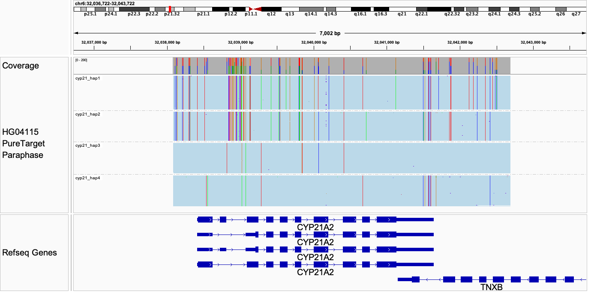

# Running Paraphase on targeted data

## Data types

Paraphase can work with targeted sequencing data, such as:
- Shotgun type enrichment data, i.e. [hybrid capture based enrichment](https://www.pacb.com/wp-content/uploads/Twist-dark-regions-application-brief.pdf) data. For this data type, the read length is generally shorter than WGS, which may result in less accurate phasing, especially when gene copies are highly similar to each other. Therefore, we recommend sequencing to a higher depth (>50X) than WGS.
- Amplicon data or CRISPR-Cas9 targeted data, such as [PureTarget]((https://www.pacb.com/technology/puretarget)). For this data type, the entire target region is fully contained in a read, making it easier to determine haplotypes compared to the shotgun type data. We generally recommend sequencing to per-haplotype depth of 8-15X. However, a higher coverage (>15X) may be desired for short target regions. This is because for short regions it is possible for two haplotypes in the same sample to be identical in sequence, requiring Paraphase to adjust the haplotype copy numbers based on the relative depth difference between these haplotypes (e.g. one haplotype has twice the supporting reads of another haplotype, indicating the presence of two identical copies). The higher depth is needed to perform the copy number adjustment more accurately.

## Config file

The Paraphase config file needs to be modified based on the design of the target panel. Take the panel design for CYP21A2/CYP21A1P as an example.

```yaml
{
  cyp21:
    realign_region: chr6:32038085-32042687
    extract_regions: chr6:31980000-32046800
    left_boundary: 32038085
    right_boundary: 32042687
}
```

Each target region has an arbitrary name, e.g. `cyp21` here. 

`realign_region` specifies the main region of interest and the coordinates should refect the panel design (`realign_region` can be equal to or slightly bigger than the panel design). This is where we want all reads to be realigned to, i.e. one region selected for a homology group (e.g. CYP21A2 region for the CYP21A2/CYP21A1P group). 

`extract_regions` specifies the regions where we want to extract relevant reads from the input bam, i.e. all the homologous regions (e.g. CYP21A2 and CYP21A1P) (where the reads might align or misalign in the genome bam). Multiple regions can be provided, separated by space.

`left_boundary` and `right_boundary` are optional. If they are not provided, Paraphase will perform phasing between the start and end coordinates in `realign_region` and all positions between them will be reported in the VCF. If `left_boundary` and `right_boundary` are provided, Paraphase will perform phasing between `left_boundary` and `right_boundary`, reporting all positions between them in the VCF. 

Please don't hesitate to reach out to Xiao Chen (xchen@pacificbiosciences.com) if you need assistance with config files.

## Command line options

Paraphase provides a few options for users to better work with targeted data: 
1) Use the `--targeted` option to drop the assumption of uniform coverage across the genome. With the `--targeted` option, Paraphase will not perform any depth normalization against the rest of the genome.
2) Additionally there are two optional parameters designed for targeted data. The default values are expected to work well with high depth data since they are frequency-based. But users can tune them based on the depth of their data and the expected copy numbers of their regions of interest. 
- `--min-variant-frequency`:  Minimum frequency for a variant to be used for phasing. The cutoff for variant-supporting reads is determined by max(5, total_depth * min_frequency). Note that total_depth is the combined depth of all paralogs for a paralog group. Default is 0.11. 
- `--min-haplotype-frequency`: Minimum frequency of unique supporting reads for a haplotype. The cutoff for haplotype-supporting reads is determined by max(4, total_depth * min_frequency). Note that total_depth is the combined depth of all paralogs for a paralog group. Default is 0.03. This cutoff can be increased to filter out spurious and low-frequency haplotypes.

## Examples

Below we will use PureTarget data as an example.

Paraphase can be run with the following command. Note the custom config file and the `--targeted` option.

```bash
paraphase -b input.bam -o output_directory -r genome_fasta -c custom_config.yaml --targeted
```

Paraphase reports four haplotypes for this sample (including CYP21A2 and CYP21A1P copies), and reads are separated by haplotypes in `.paraphase.bam`. Not that only HiFi reads (`rq`>=0.99) are used in Paraphase, even if the input Bam contains reads with lower rqs.

