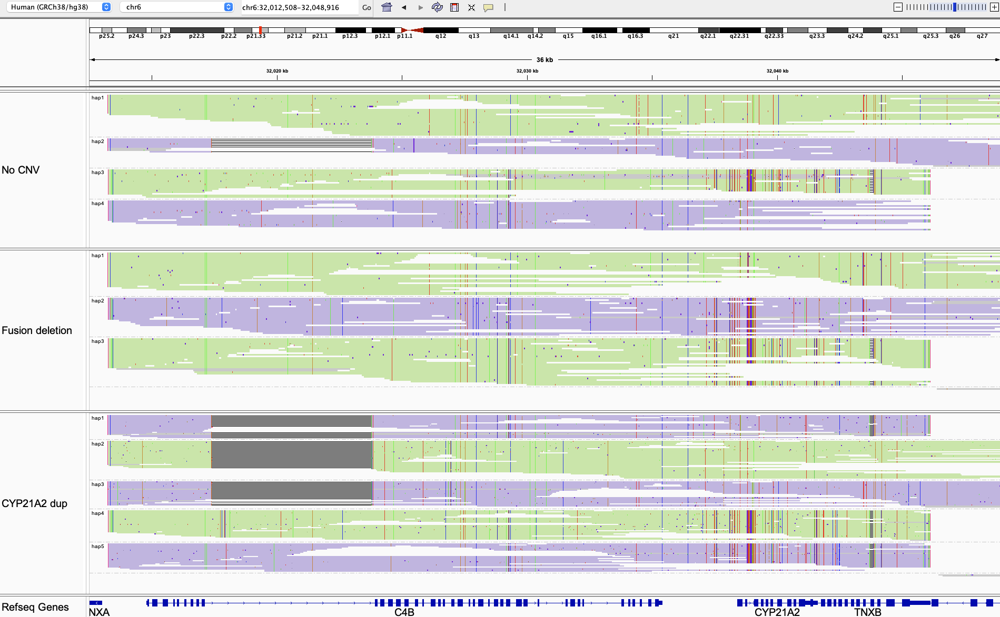

# Paraphase VCF

Paraphase produces a VCF file for each region per sample.

As genes of the same family can be highly similar to each other in sequence and not easy to differentiate (at the sequence level or even at the functional level), variant calls are made against one selected "main" gene from the gene family (e.g. the functional gene is selected when the family has a gene and a pseudogene). In this way, all copies of the gene family can be evaluated for pathogenic variants and one can calculate the copy number of the functional genes in the family and hence infer the disease/carrier status.

If provided with prior knowledge on paralog differentiation, Paraphase can assign haplotypes into different genes in the family and give them a label. This is currently done for SMN1 (paralog SMN2), PMS2 (pseudogene PMS2CL), STRC (pseudogene STRCP1), NCF1 (pseudogenes NCF1B and NCF1C) and IKBKG (pseudogene IKBKGP1). In these families, haplotypes are assigned to each gene in the family, i.e. gene or paralog/pseudogene, and variants are called against the gene (or paralog/pseudogene) for the gene (or paralog/pseudogene) haplotypes, respectively. If desired, you can ask Paraphase to call all variants against just the main gene for these five families with the `--gene1only` option.

## VCF format

We have repurposed the sample column to report haplotypes (gene copies) found in a region (gene family). Each column represents a haplotype. The haplotype names are consistent with those reported in the `json` file. 

In the INFO field, we report the boundaries of haplotypes with `HPBOUND`, which is a pair of numbers representing the start and end coordinates of the haplotype, i.e. phase block. In the case of complete phasing, these numbers represent the start and end of the region that Paraphase is designed to phase. Otherwise, sometimes Paraphase can only phase part of the region and the start and end of the phase blocks are reflected by these numbers. The coordinates are sometimes prefixed or appended by the word `truncated`, which means that the haplotypes are clipped right before or after. This marks the end of the homology and these truncated haplotypes are often those from the paralog or the pseudogene. The `HPBOUND` field is useful when annotating variants in Paraphase VCFs as the boundaries and the truncated status can be compared against the gene/transcript coordinates to determine if we have full information for the complete gene.

When Paraphase is able to phase haplotypes into two chromosomes, this information is reported in the VCF under `ALLELE` in the INFO field. Haplotypes on the same chromosome are grouped together, separated by `+`, and the two chomosomes are separated by `,`.

## Example

| #CHROM | POS      | ID | REF | ALT | QUAL | FILTER | INFO                                                                                                                                                                                  | FORMAT   | rccx_hap1 | rccx_hap2 | rccx_hap3 | rccx_hap4 | rccx_hap5 |
| :------| :------- | :- | :-- | :-- | :--- | :----- | :------------------------------------------------------------------------------------------------------------------------------------------------------------------------------------ | :--------| :---------| :---------| :---------| :---------| :---------|
| chr6   | 32013369 | .  | T   | C   | .    | PASS   | HPBOUND=32013300-32046127truncated,32013300-32046200,32013300-32046200,32013300-32046127truncated,32013300-32046127truncated;ALLELE=rccx_hap2+rccx_hap4,rccx_hap1+rccx_hap3+rccx_hap5 | GT:DP:AD | 1:19:0,19 | 1:24:0,24 | 1:23:0,23 | 0:21:21,0 | 0:23:23,0 |

Here is one line from the VCF of the bottom sample in the figure below. Based on the `HPBOUND` and `ALLELE` INFO fields, we can infer the following:
There are five copies of the RCCX repeat, phased into two chomosomes `rccx_hap2+rccx_hap4` and `rccx_hap1+rccx_hap3+rccx_hap5`. `hap2` and `hap3` are phased all the way through the region end `32046200`, and the other three copies are clipped slightly earlier at `32046127`, which is the end of the homology region between RCCX and the paralogous copy. These three copies only carry a truncated version of TNXB.

