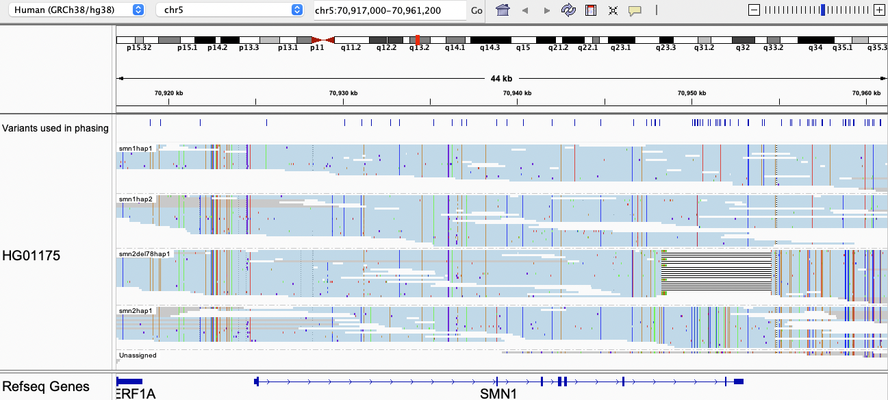
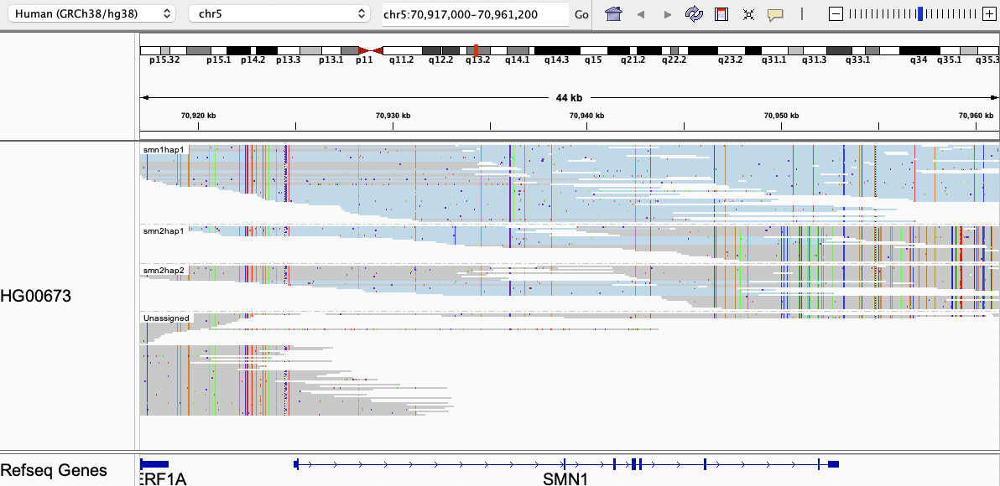

# Visualizing the output

We can visualize the haplotypes by loading the output file `_realigned_tagged.bam` into IGV and grouping reads by the `HP` tag.

## Example 1

In this example, there are two copies of SMN1, one copy of SMN2Δ7–8, and one copy of intact SMN2. All reads are aligned to SMN1. Polymorphic sites used for phasing/assembling haplotypes are shown in the top panel. The `Unassigned` category contains reads that carry bases that do not agree with any haplotypes (this could be due to sequencing errors or short haplotypes).

## Example 2

In this example, there are three copies of SMN1 and one copy of SMN2. Reads in blue are uniquely assigned to a haplotype. Reads in gray are consistent with more than one possible haplotype (this happens when those haplotypes are identical over a region). Here `smn1hap1`, `smn1hap3` and `smn2hap1` are identical from the region upstream of SMN1 all the way to halfway into Intron 1 (their sequences are identical at the first two variant sites). When there are several possible haplotypes consisent with a read, the read is randomly assigned to a haplotype and colored in gray. 

## Example 3

In this example, Paraphase assembles one SMN1 haplotype and two SMN2 haplotypes. The depth of `smn1hap1` suggests that it is present in two copies, so Paraphase infers that there are two copies of SMN1 (their haplotype sequences are identical). Note that the majority of the `Unassigned` reads are "unassigned" because they do not overlap any polymorphic site.

The [examples](../examples/) folders contains IGV sessions showing a few more examples. IGV session files for 107 Coriell samples can be downloaded from [here](https://github.com/xiao-chen-xc/SMN_phased_data).
